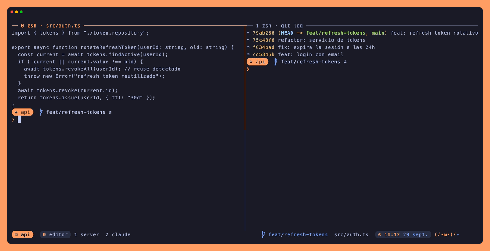
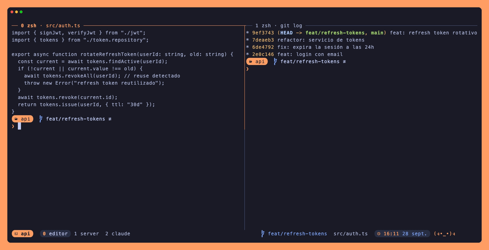

<div align="center">

# tmux-kamehameha

**Tema Tokyo Night con acento naranja para tmux, con una mascota que carga un kamehameha en tu barra.**

Pickers estilo Telescope para saltar entre sesiones y buscar texto en todos tus panes, y avisos cuando Claude Code termina en otra ventana.




</div>

## Qué trae

- 🟠 **Barra transparente** con pills: sesión, ventana actual, rama git del pane, título del pane y hora. La pill de la sesión se pone azul mientras el prefix está activo.
- 🥋 **Mascota animada** que carga y dispara un kamehameha, y reacciona a lo que haces.
- 🔭 **`prefix f`**: selector de sesiones estilo Telescope, con preview y navegación entre ventanas.
- 🔎 **`prefix g`**: fuzzy search de texto en todos los panes de todas las sesiones, con scrollback.
- 🔔 **Avisos**: una ventana o sesión con bell se marca en naranja, y con el extra de Claude Code cada Claude avisa al terminar.
- 🪟 **Panes con etiqueta** (número, comando y título) cuando hay 2 o más, y los inactivos atenuados.
- ✂️ **Splits** con `prefix |` y `prefix -` que abren en la carpeta actual, y numeración de ventanas sin huecos.

## La mascota

Un frame por segundo, con el mismo ancho en todos para que la barra no se mueva.

| Cuándo | Qué hace |
|--------|----------|
| Normal | Carga `(ﾉ•ω•)ﾉ·` → `∘` → `○` → `●` → `◉`, dispara `(ﾉ>ω<)ﾉ━●` → `━━━━━━✺` con gradiente, suelta chispas `ﾟ･✧` y descansa `(ง˘ω˘)ง`. Ciclo de 12 s |
| Apretaste el prefix | En guardia: `(ง°Д°)ง` |
| Un pane en zoom | Super Saiyajin, en amarillo y con el aura parpadeando: `ϟ(ﾉ>Д<)ﾉϟ` |
| Batería bajo 20% y desenchufada (macOS) | Cansado: `(ﾉ-ω-)ﾉ zzz` |

## Selector de sesiones · `prefix f`



| Tecla | Qué hace |
|-------|----------|
| Escribir | Filtra las sesiones (fuzzy) |
| `↑` / `↓` | Cambia de sesión |
| `←` / `→` o `Tab` / `Shift+Tab` | Recorre las ventanas de la sesión dentro del preview (con scroll si son muchas) |
| `Enter` | Entra a la ventana marcada |

## Buscador de texto · `prefix g`


Busca en las últimas 5000 líneas de cada pane. El preview centra la línea encontrada y `Enter` te lleva a ese pane en copy-mode, parado sobre ella. Para una búsqueda exacta, empieza con `'` (`'refresh token`).

## Instalación

Necesitas:

- tmux 3.4 o superior (probado en 3.6a)
- [fzf](https://github.com/junegunn/fzf) 0.58 o superior
- Una [Nerd Font](https://www.nerdfonts.com/) en la terminal
- Truecolor: `set -ag terminal-overrides ",xterm-256color:RGB"`

Con [TPM](https://github.com/tmux-plugins/tpm), en `~/.tmux.conf`:

```tmux
set -g @plugin 'victord-exe/tmux-kamehameha'
```

Luego `prefix I` para instalar y `prefix U` para actualizar.

## Opciones

Van antes de la línea `run '~/.tmux/plugins/tpm/tpm'`.

| Opción | Default | Qué hace |
|--------|---------|----------|
| `@kamehameha-theme` | `kamehameha` | `skyline` cambia el acento naranja por el azul del Skyline de Brian (`#3d85ff`, con plateado de secundario) |
| `@kamehameha-pet` | `on` | `off` quita la mascota |
| `@kamehameha-sessions-key` | `f` | Tecla del selector de sesiones |
| `@kamehameha-search-key` | `g` | Tecla del buscador de texto |

```tmux
set -g @kamehameha-theme 'skyline'
set -g @kamehameha-pet 'off'
set -g @kamehameha-search-key '/'
```

El tema también llega a los extras: el status line de Claude Code lo lee de tmux y el prompt de oh-my-posh de la variable `KAMEHAMEHA_THEME`, que el plugin exporta a los shells nuevos.

Cuántas ventanas se ven a la vez en el preview (`MAX` en `scripts/session-picker.sh`) y cuánto historial lee el buscador (`HIST` en `scripts/text-search.sh`) se cambian en los scripts.

## Extras

No los carga TPM: son para que el resto de la terminal combine con el tema. Se ven en los GIFs de arriba.

### Claude Code: avisos y status line

**Avisos.** `extras/claude-code/tmux-bell.sh` hace sonar la bell en el pane donde corre Claude, y tmux marca esa ventana en naranja. Cópialo a `~/.claude/scripts/` y regístralo como hook en `~/.claude/settings.json`:

```json
"hooks": {
  "Stop": [{ "matcher": "", "hooks": [{ "type": "command", "command": "bash ~/.claude/scripts/tmux-bell.sh", "timeout": 3 }] }],
  "Notification": [{ "matcher": "", "hooks": [{ "type": "command", "command": "bash ~/.claude/scripts/tmux-bell.sh", "timeout": 3 }] }]
}
```

Claude Code carga los hooks al arrancar: las sesiones abiertas antes de agregarlos no avisan hasta que las reinicies.

**Status line.** `extras/claude-code/statusline.js` usa la misma paleta. A la izquierda muestra el modelo, la carpeta, la rama y el costo; a la derecha, las barras de contexto, sesión y semana. Dentro de tmux usa el ancho del pane para ir en una sola línea: si no cabe, achica las barras, y si tampoco, lo parte en dos.

```json
"statusLine": { "type": "command", "command": "node ~/.claude/statusline.js", "padding": 2 }
```

### oh-my-posh

`extras/oh-my-posh/kamehameha.omp.json` es el prompt que ves en los demos. Muestra la carpeta en una pill naranja y la rama git. También muestra la duración si el comando tardó más de 3 s y `✘ código` si falló. El perfil de AWS aparece solo si no es `default`. La flecha `❯` va en su propia línea, y el transient prompt reduce los comandos anteriores a `❯ comando`.

```sh
eval "$(oh-my-posh init zsh --config /ruta/a/kamehameha.omp.json)"
```

## Regenerar los demos

Los GIFs salen de [VHS](https://github.com/charmbracelet/vhs) sobre un servidor tmux aparte (`-L kh-demo`), con sesiones y contenido de ejemplo, así que no tocan tu tmux:

```sh
brew install vhs
vhs demo/hero.tape && vhs demo/sessions.tape && vhs demo/search.tape
```

`demo/setup.sh` arma ese servidor; puedes correrlo solo y entrar con `tmux -L kh-demo attach -t api`.

## Créditos

- Paleta basada en [Tokyo Night](https://github.com/enkia/tokyo-night-vscode-theme)
- Pickers hechos con [fzf](https://github.com/junegunn/fzf), inspirados en [telescope.nvim](https://github.com/nvim-telescope/telescope.nvim)
- Demos grabados con [VHS](https://github.com/charmbracelet/vhs)

## Licencia

[MIT](LICENSE)
